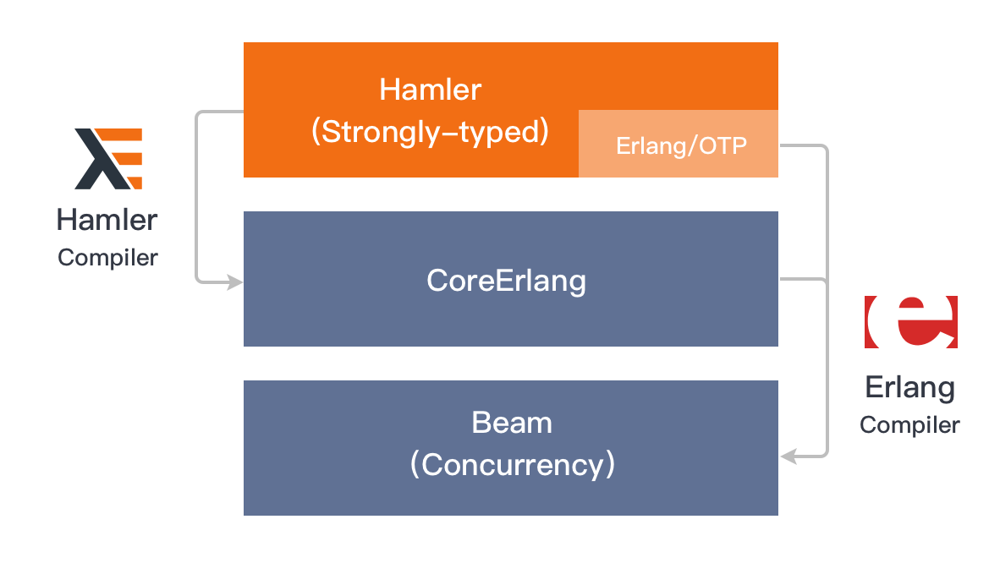

# The Hamler Programming Language

**Hamler** is a strongly-typed language with compile-time typechecking and built-in support for concurrency and distribution.

**Hamler** empowers industries to build the next generation of scalable, reliable, realtime applications, especially for 5G, IoT and edge computing.

## Why Hamler?

For almost a decade, we have been developing software systems based on Erlang/OTP, especially our main product [EMQ X](https://github.com/emqx/emqx) - the scalable open-source MQTT broker. So, we have always believed that Erlang is a masterpiece of engineering. With amazing concurrency, distribution and fault tolerance, it is one of the few general-purpose language platforms able to properly handle concurrency and soft realtime.

However, from all the experience writing Erlang, we believe that the following features can help Erlang programmer better adapt to the coming wave of 5G, IoT and edge-programming and attract more people for using BEAM.

- Compile-time type checking and type reference
- ADTs, Function Composition, Type Classes
- More friendly syntax for prosperous communities
- Functor, Applicative and Monad...:)

Now all the features are avaliable in the Hamler programming language.

## Features

- Functional programming
- Haskell and ML-style syntax
- Compile-time type Checking/Inference
- Algebraic data type (ADT)
- Functions, higher-order functions
- Currying and partial application
- Pattern matching, and Guards
- List comprehension
- Applicative and Monad
- Advanced module system
- Built-in concurrency

## Design

The Hamler compiler architecture is shown as below:



The Hamler 0.1 compiler was forked from [PureScript][PureScriptHamler] 0.13.6. The Hamler source code is parsed to generate CST, then CoreErlang's IR is generated after **CST -> AST -> CoreFn**'s syntax tree transformation, syntax analysis and type checking. The code is then used by the Erlang compiler to generate the final Beam bytecode.

[PureScriptHamler]: https://github.com/hamler-lang/purescript

## Installation

Get installation packages from [Github Release](https://github.com/hamler-lang/hamler/releases)

*Note: packages for windows will be coming soon...*

**Linux**

```shell
$ tar zxvf hamler-$version.tgz -C /usr/lib/hamler
$ ln -s /usr/lib/hamler/bin/hamer /usr/bin/hamler
```

**Centos 7**

```shell
$ rpm -ivh hamler-$version-1.el7.x86_64.rpm
```

**Debian 8 / Debian 9 / Debian 10 / Ubuntu 16.04 / Ubuntu 18.04 / Ubuntu 20.04**

```shell
$ dpkg -i hamler_$version_amd64.deb
```

**Homebrew(macOS)**

```shell
brew tap hamler-lang/hamler
brew install hamler
```

**Build from source code(macOS)**

1. Install Erlang

   ```shell
   brew install erlang@22
   ```

2. Install Stack

   ```shell
   brew install haskell-stack
   ```

3. Clone hamler from the git repo

   ```shell
   git clone https://github.com/hamler-lang/hamler.git
   ```

4. Install hamler

   ```shell
   cd hamler
   make
   make install
   ```

## Create a project

  ```shell
  mkdir demo-project
  cd demo-project
  hamler init
  make
  make run
  ```

## Try the interpreter

  ```shell
  hamler repl

  > -- List, range and enums
  > [1,2,3]
  > [1..10]
  > ['a'..'z']

  > -- erlang style maps
  > import Data.Map as Map
  > -- New map
  > m = #{"foo" => "bar", "bar" => "foo"}
  > -- Match Map
  > #{"foo" := a, "bar" := b} = m
  > -- get, put
  > Map.get "foo" m -- a = "bar"
  > Map.get "bar" m -- b = "foo"
  > m1 = Map.put "key" "val"
  > -- keys, values
  > keys = Map.keys m
  > values = Map.values m
  ```

### Documentation

- [Cheatsheet][Cheatsheet]
- [Why Hamler?][WhyHamler]
- [Quick Start][QuickStart]
- [Basic Types, Functions and Operators][BasicTypesFunctionsAndOperators]
- [More Types and Pattern Matching][MoreTypesandPatternMatching]
- [High Order Functions And Recursions][HigherOrderFunctionsAndRecursions]
- [Type Classes][TypeClasses]
- [Applicative and Monad][ApplicativeAndMonad]
- [Foreign Language Interface][ForeignFunctionInterface]
- [Data Types Mapping][DataTypesMapping]
- [Message Passing Concurrency][MessagePassingConcurrency]
- [OTP Behaviours][OTPBehaviours]
- [Node and Distributed Erlang][NodeAndDistributedErlang]
- [Differences From Erlang][DifferencesFromErlang]
- [FAQ][FAQ]

[Cheatsheet]: https://github.com/hamler-lang/documentation/blob/master/Cheatsheet.md
[WhyHamler]: https://github.com/hamler-lang/documentation/blob/master/guides/01_WhyHamler.md
[QuickStart]: https://github.com/hamler-lang/documentation/blob/master/guides/02_QuickStart.md
[BasicTypesFunctionsAndOperators]: https://github.com/hamler-lang/documentation/blob/master/guides/03_BasicTypesFunctionsAndOperators.md
[MoreTypesandPatternMatching]: https://github.com/hamler-lang/documentation/blob/master/guides/04_MoreTypesandPatternMatching.md
[HigherOrderFunctionsAndRecursions]: https://github.com/hamler-lang/documentation/blob/master/guides/05_HigherOrderFunctionsAndRecursions.md
[TypeClasses]: https://github.com/hamler-lang/documentation/blob/master/guides/06_TypeClasses.md
[ApplicativeAndMonad]: https://github.com/hamler-lang/documentation/blob/master/guides/07_ApplicativeAndMonad.md
[ForeignFunctionInterface]: https://github.com/hamler-lang/documentation/blob/master/guides/08_ForeignFunctionInterface.md
[DataTypesMapping]: https://github.com/hamler-lang/documentation/blob/master/guides/09_DataTypesMapping.md
[MessagePassingConcurrency]: https://github.com/hamler-lang/documentation/blob/master/guides/10_MessagePassingConcurrency.md
[OTPBehaviours]: https://github.com/hamler-lang/documentation/blob/master/guides/11_OTPBehaviours.md
[NodeAndDistributedErlang]: https://github.com/hamler-lang/documentation/blob/master/guides/12_NodeAndDistributedErlang.md
[DifferencesFromErlang]: https://github.com/hamler-lang/documentation/blob/master/guides/13_DifferencesFromErlang.md
[FAQ]: https://github.com/hamler-lang/documentation/blob/master/FAQ.md

## Community, discussion and supports

You can reach the **Hamler** community and core team via the following channels:

- [Slack - emqx/hamler-lang](https://slack-invite.emqx.io/)
- [Twitter - @hamlerlang](https://twitter.com/hamlerlang)
- [Reddit - /r/HamlerLang](https://www.reddit.com/r/HamlerLang/)
- [Medium - @hamlerlang](https://medium.com/@hamlerlang)

## Contributing

To contribute to **Hamler** project:

- Report issues: submit any bugs, issues to [hamler/issues][hamler-issues]
- Contribute code: Fork the project, and submit feature requests to [hamler-lang/hamler][hamler-project]
- Submit a proposal: Fork the [hamler-wiki][hamler-wiki] project and submit pull request

[hamler-issues]: https://github.com/hamler-lang/hamler/issues
[hamler-project]: https://github.com/hamler-lang/hamler
[hamler-wiki]: https://github.com/hamler-lang/hamler-wiki

## Core Team

The Hamler core team comes from [EMQ Technologies Co., Ltd.](https://emqx.io/) now:

- [Feng Lee](https://github.com/emqplus): Designer of Hamler Language
- [Yang M](https://github.com/EMQ-YangM): Implemented Hamler Compiler
- [S Hu](https://github.com/SjWho): Maintainer of the documentations
- [Shawn](https://github.com/terry-xiaoyu): Contributed [rebar3_hamler][rebar3_hamler] plugin
- [Rory Z](https://github.com/zhanghongtong): Contributed [homebrew][homebrew] install package
- [wivwiv](https://github.com/wivwiv): Designer of hamler-lang.org website
- [CrazyWisdom](https://github.com/CrazyWisdom): Maintainer of hamler-lang.org
- [ysfscream](https://github.com/ysfscream): Maintainer of hamler-lang.org
- [juan6666](https://github.com/juan6666)：Designer of Hamler language logo

[homebrew]: https://github.com/hamler-lang/homebrew-hamler
[rebar3_hamler]: https://github.com/hamler-lang/rebar3_hamler

## License & Credits

We would like to express our great appreciation to the [PureScript][PureScriptSite] team and community for all years of efforts making its amazing compiler, especially **CoreFn** and its incredible adaptability.

The hamler language project is licensed under BSD3, see [LICENSE](./LICENSE).

[PureScriptSite]: https://www.purescript.org/

## About EMQ

[**EMQ**](https://emqx.io/) is an open-source software company providing highly-scalable, real-time messaging and streaming platform for IoT applications in 5G Era.
